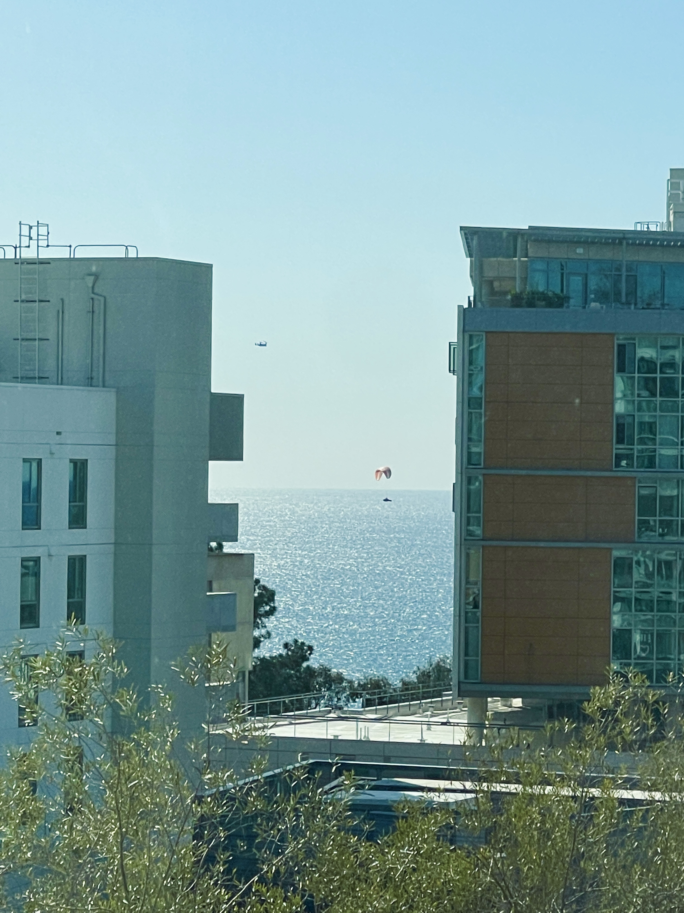

# User Page
## Personal information
Hi! I'm **Ada Qi** from Sixth College of UCSD. I'm a sophomore and my major is *cognitive science*. I've learned `java` and `c++` previously. 
```
Hello world!
```
> Sometimes creativity is a compulsion, not an ambition. (Ed Norton)

## Links
This is my [Github site](https://github.com/AdaQi-001).
This is my [README file](README.md).
This is a link to the section ["Personal information"](#personal-information).

## Lists
### Unordered and nested list
The courses I take this quarter:
- CSE 110
  - Tue, Thu;
    - note: lab on Wed;
- PHYS 2C
  - Mon, Wed, Fri;
    - note: discussion on Fri;
- CSE 251A
  - Tue, Thu;
- JAPN 10C
  - Mon, Tue, Wed, Thu, Fri;

### Ordered list
Sequence of the final exams:
1. PHYS 2C
2. JAPN 10C
3. CSE 110

### Task lists
Prerequisites:
- [ ] CSE 100
- [x] CSE 100R